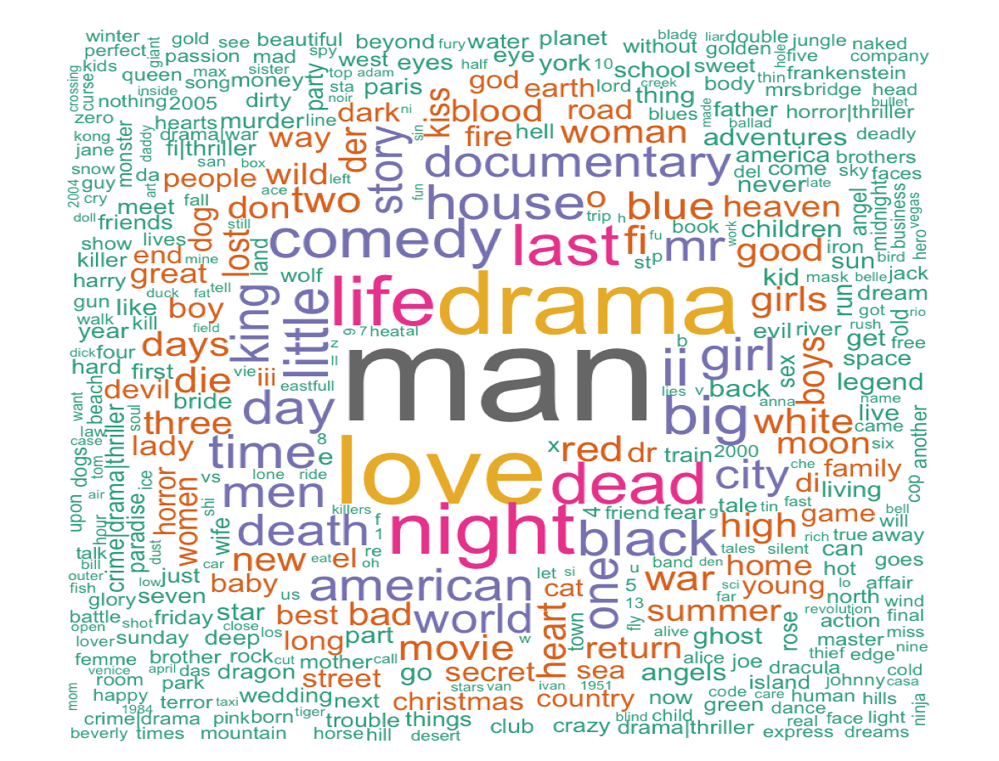

# Libraries

```{r,warning=F,message=FALSE}

library(readr)
library(plotly)
library(ggplot2)
library(highcharter)
library(ngram)
library(png)
library(stringr)
library(dplyr)
library("tm")
library("wordcloud")
library(corrplot)
library(arules)
library(arulesViz)
library(colorspace)

```

# Preparing dataset:
```{r,warning=F,message=FALSE}
setwd("/Users/Apple/Documents/TaraFiles/University/term 8/Data Analysis/week 12/")

movie = read_delim("./movie/movies.dat",
                   delim = "::",col_names = c("MovieID",NA,"Title",NA,"Genres"))
movie = movie %>% select(1,3,5)
movie$MovieID=as.numeric(movie$MovieID)

tag = read_delim("./movie/tags.dat",
                 delim = "::",col_names = c("UserID",NA,"MovieID",NA,"Tag",NA,"Timestamp"))
tag = tag %>% select(1,3,5,7)
tag$MovieID=as.numeric(tag$MovieID)

rating = read_delim("./movie/ratings.dat",
                    delim = "::",col_names = c("UserID",NA,"MovieID",NA,"Rating",NA,"Timestamp"))
rating = rating %>% select(1,3,5,7)
rating$MovieID=as.numeric(rating$MovieID)
rating$Rating=as.numeric(rating$Rating)
```


# 1.

```{r,warning=F,message=FALSE}
# popular

rating%>%select(MovieID,Rating)%>%group_by(MovieID)%>%
  summarise(meanRate=mean(Rating,na.rm = T))%>%arrange(-meanRate)->popularity
popularity$MovieID[1:5]->popularID
movie$Title[ which(movie$MovieID %in% popularID) ]

# number of comments

rating%>%select(MovieID,Rating)%>%group_by(MovieID)%>%
  summarise(numComments=n())%>%arrange(-numComments)->num_of_Comments
num_of_Comments$MovieID[1:5]->num_of_CommentsID
movie$Title[ which(movie$MovieID %in% num_of_CommentsID) ]

# least popular

popularity%>% arrange(meanRate)-> L_pop
L_pop$MovieID[1:3]->L_popID
movie$Title[ which(movie$MovieID %in% L_popID) ]


# num of movie each year
movie%>%mutate(year=as.numeric(str_sub(Title,-5,-2)))->movie

movie%>%filter(!is.na(year))%>%group_by(year)%>%summarise(numMovie=n())->Movie_Year
Movie_Year=Movie_Year[-c(1:10),]

Movie_Year%>%hchart(type = "bar",hcaes(x = year, y = numMovie),name = "num of movie each year")%>%
  hc_title(text = "num of movie each year")


# fav genre each year
movie%>%mutate(Action=as.numeric(str_detect(Genres,"Action")),
               Adventure=as.numeric(str_detect(Genres,"Adventure")),
               Animation=as.numeric(str_detect(Genres,"Animation")),
               Children=as.numeric(str_detect(Genres,"Children")),
               Comedy=as.numeric(str_detect(Genres,"Comedy")),
               Crime=as.numeric(str_detect(Genres,"Crime")),
               Documentary=as.numeric(str_detect(Genres,"Documentary")),
               Drama=as.numeric(str_detect(Genres,"Drama")),
               Fantasy=as.numeric(str_detect(Genres,"Fantasy")),
               Film_Noir=as.numeric(str_detect(Genres,"Film-Noir")),
               Horror=as.numeric(str_detect(Genres,"Horror")),
               Mystery=as.numeric(str_detect(Genres,"Mystery")),
               Romance=as.numeric(str_detect(Genres,"Romance")),
               Sci_Fi=as.numeric(str_detect(Genres,"Sci-Fi")),
               Thriller=as.numeric(str_detect(Genres,"Thriller")),
               War=as.numeric(str_detect(Genres,"War")),
               Western=as.numeric(str_detect(Genres,"Western")))->movie_with_genres


right_join(popularity,movie_with_genres,by="MovieID")->genre_movie_rate 


genre_movie_rate%>%group_by(year)%>%na.omit()%>%summarise(Action=sum(Action*meanRate)/sum(Action),
                                               Adventure=sum(Adventure*meanRate)/sum(Adventure),
                                               Animation=sum(Animation*meanRate)/sum(Animation),
                                               Children=sum(Children*meanRate)/sum(Children),
                                               Comedy=sum(Comedy*meanRate)/sum(Comedy),
                                               Crime=sum(Crime*meanRate)/sum(Crime),
                                               Documentary=sum(Documentary*meanRate)/sum(Documentary),
                                               Drama=sum(Drama*meanRate)/sum(Drama),
                                               Fantasy=sum(Fantasy*meanRate)/sum(Fantasy),
                                               Film_Noir=sum(Film_Noir*meanRate)/sum(Film_Noir),
                                               Horror=sum(Horror*meanRate)/sum(Horror),
                                               Mystery=sum(Mystery*meanRate)/sum(Mystery),
                                               Romance=sum(Romance*meanRate)/sum(Romance),
                                               Sci_Fi=sum(Sci_Fi*meanRate)/sum(Sci_Fi),
                                               Thriller=sum(Thriller*meanRate)/sum(Thriller),
                                               War=sum(War*meanRate)/sum(War),
                                               Western=sum(Western*meanRate)/sum(Western))->movie_year_genres
movie_year_genres[is.na(movie_year_genres)] <-0

movie_year_genres[, "max"] <- do.call(pmax,movie_year_genres[ 2:17])
movie_year_genres$pop_genre=""
for (i in 1:dim(movie_year_genres)[1]) {
  loc=which.max(movie_year_genres[i,2:17])
  movie_year_genres$pop_genre[i]=names(movie_year_genres)[loc+1]
}


movie_year_genres%>%hchart(type = "bar",hcaes(x = year, y = max,name =pop_genre,group=pop_genre))%>%
  hc_title(text = "pop_genre of each year")%>%
  hc_subtitle("hold on the bar to see the name of the genre")

movie_year_genres%>%filter(year>1980) %>%hchart(type = "bar",hcaes(x = year, y = max,name =pop_genre,group=pop_genre))%>%
  hc_title(text = "pop_genre of each year (after 1980)")%>%hc_subtitle("hold on the bar to see the name of the genre")


```
***

# 2.

```{r,warning=F,message=FALSE}
# num of movie per genre


genreName=c("Action","Adventure","Animation","Children's","Comedy","Crime",
            "Documentary","Drama","Fantasy","Film-Noir","Horror",
            "Mystery","Romance","Sci-Fi","Thriller","War","Western")

GenereInMovie=movie$Genres
strsplit(GenereInMovie,"\\|")%>%unlist()%>%table() %>% 
  as.data.frame(stringsAsFactors = F)->GenereInMovie
GenereInMovie=GenereInMovie[-c(1:19),] 
names(GenereInMovie)=c("Genre","Freq")
GenereInMovie%>%arrange(Freq)%>%hchart(type = "bar",hcaes(x = Genre, y = Freq),name = " num of movie of each genre")%>%
  hc_title(text = " num of movie of each genre")


####   نمودار همبستگی ژانرها 

movie_with_genres[,5:21]->m
m%>%na.omit()->m

res <- cor(m, method = "pearson", use = "complete.obs")
corrplot(res, type = "upper", order = "hclust", 
         tl.col = "black", tl.srt = 45)

# متوسط امتیاز به هر ژانر

genre_movie_rate%>%na.omit()%>%summarise(Action_=sum(Action*meanRate)/sum(Action),
                                                          Adventure_=sum(Adventure*meanRate)/sum(Adventure),
                                                          Animation_=sum(Animation*meanRate)/sum(Animation),
                                                          Children_=sum(Children*meanRate)/sum(Children),
                                                          Comedy_=sum(Comedy*meanRate)/sum(Comedy),
                                                          Crime_=sum(Crime*meanRate)/sum(Crime),
                                                          Documentary_=sum(Documentary*meanRate)/sum(Documentary),
                                                          Drama_=sum(Drama*meanRate)/sum(Drama),
                                                          Fantasy_=sum(Fantasy*meanRate)/sum(Fantasy),
                                                          Film_Noir_=sum(Film_Noir*meanRate)/sum(Film_Noir),
                                                          Horror_=sum(Horror*meanRate)/sum(Horror),
                                                          Mystery_=sum(Mystery*meanRate)/sum(Mystery),
                                                          Romance_=sum(Romance*meanRate)/sum(Romance),
                                                          Sci_Fi_=sum(Sci_Fi*meanRate)/sum(Sci_Fi),
                                                          Thriller_=sum(Thriller*meanRate)/sum(Thriller),
                                                          War_=sum(War*meanRate)/sum(War),
                                                          Western_=sum(Western*meanRate)/sum(Western))->ccc
rate=as.numeric(ccc[1,])
c4=data.frame(genreName=genreName,rate=rate)

c4%>%arrange(rate)%>%hchart(type = "bar",hcaes(x = genreName, y =rate,name =genreName,group=genreName))%>%
  hc_title(text = "mean rate of genres")


# دوران طلایی فیلم سازی


right_join(popularity,movie,by="MovieID")%>%group_by(year)%>%
  summarise(meanRateYear=mean(meanRate))->goldenAge
goldenAge=goldenAge[-c(1:10),]

goldenAge%>%na.omit()%>%arrange(-meanRateYear)->goldenAge

head(goldenAge,n=3)


```
***

# 3.

```{r,warning=F,message=FALSE}
movie%>%mutate(pureTitle=str_sub(Title,1,-7))%>%select(pureTitle)->movieTitle


movieTitle%>%str_replace_all("[[:punct:]]"," ") %>% 
  str_split(pattern = "\\s") %>% 
  unlist() %>% 
  str_to_lower() %>% 
  removeWords(., stopwords('en')) %>% 
  removeWords(., stopwords('fr')) %>%
  str_trim() %>% 
  table() %>% 
  as.data.frame(stringsAsFactors = F)->title_word
colnames(title_word) = c("word","count")
title_word = title_word %>% arrange(desc(count)) %>% filter(count>5)

title_word=title_word[-c(1:4,9,11,35,44,64,75,102),]
wordcloud(title_word$word,title_word$count,
          c(5,.3), random.order = FALSE, colors=brewer.pal(8, "Dark2"))

```

<div align="center">

</div>

***

# 4.

```{r,warning=F,message=FALSE }
# Q4

rating%>%filter(Rating>3)%>%select(MovieID,UserID)%>%
  group_by(UserID)%>%summarise(basket=concatenate(MovieID,collapse = ","))->User_Basket
basket = lapply(User_Basket$basket,FUN = function(x) strsplit(x,split = ",")[[1]])

grules = apriori(basket, parameter = list(support = 0.009,
                                             confidence = 0.25, minlen = 2))
inspect(grules[1:10])


#Castle in the Sky (1986)   6350
#Cast Away (2000)           4022
#No Country for Old Men (2007)    51372
#Memento (2000)             4226


movierules = subset(grules, lhs %pin% c("6350","4022","51372","4226"))
inspect(sort(movierules, by = "lift")[1:32])->mn
unique(mn$rhs)


mn[,c(1,3)]%>%mutate(MovieID=as.numeric(str_sub(rhs,2,-2)))->moviecode
unique(moviecode$MovieID)
movie%>%filter(MovieID %in% unique(moviecode$MovieID))%>%.[1:5,]


```

***

# 5.

https://github.com/Tara1376/DA_HW.git


***
# 6.

<p dir="RTL">
 من انتظار داشتم تئوری درس بیشتر باشد. قبول دارم که درس ، برنامه نویسی و کد زنی بود ولی جا داشت بیشتر و عمیق تر مباحث تئوری رو بررسی میکردیم. مثلا در خوشهبندی و 
 PCA 
 میشد عمیق تر شد و برای من جذاب تر هم میبود.
</p>

<p dir="RTL">
بعضی از دیتاست ها واقعا کسل کننده بودن :)))
مثلا دیتاست لالیگا. تهشم نفهمیدم به چه دردی میخورد :)
</p>

<p dir="RTL">
قسمت های انتهایی درس، مخصوصا تمرین ۱۲ کاش بیشتر میبود. 
برای مباحثی مثل نقشه خیلی وقت گذاشتیم، ولی این سیستم پیشنهاد دهنده به نظرم مفیدتر و مهم تر بود.
</p>

<p dir="RTL">
تمرین ها خیلی هاشون گنگ بودن، و همین باعث می شد بیخودی وقت زیادی صرف یک تمرین ساده بشه. 
</p>


<p dir="RTL">
پروژه تا الان هیچ فیدبکی نداشتیم. کاش روی پروپوزال اولیه فید بک میدادین تا الان، و با فاز یک رو نظر میدادین.
اصلا نمیدونیم چه حجمی کار لازم داره.
تمرین ها هم هیچ فیدبکی نداشتیم، ممکنه آدم تا آخر راه رو اشتباه بره اینجوری :)
</p>

***
# 7.

<p dir="RTL">
ساعت کلاس رو به ۱۰-۱۲ تغییر بدید
</p>

<p dir="RTL">
روی چند تا تمرین اول قبل عید فیدبک بدین، که بقیه رو درست انجام بدیم.
</p>

<p dir="RTL">پروژه رو خوب میشد بعد نوشتن پروپوزال یا حداقل بعد فاز یک، یک تحویل حضوری میداشت که بفهمیم پروژه رو درست انتخاب کردیم اصلا یا نه
</p>


<p dir="RTL">
مباحث تئوری رو عمیق تر بخونیم توی درس و حتی یک تمرین کاملا تئوری می داشتیم بد نبود
</p>


<p dir="RTL">
 اوایل ترم که مباحث ساده تر هستند رو سریعتر درس بدین تا اواخر ترم مباحث سخت تر و مهم تر رو وقت کافی داشته باشیم.
</p>


<p dir="RTL">
 
</p>

***
# 8.


nonlinear dimensionality reduction, Kernel PCA


linear SVM , and nonlinear SVM


Fuzzy clustring


***
# 9.

<p dir="RTL">
داده ای پزشکی نداشتیم. دیتاست های فراوانی با علائم بیمار و تشخیص پزشک وجود دارد. 
</p>

<p dir="RTL">
 در مباحث مربوط به انرژی دیتا ست های زیادی در باره برق و یا نیروگاه های انرژی های نو وجود دارد. چون اکثر بچه ها دانشجوی مهندسی اند جالب خواهد بود.
</p>

<p dir="RTL">
 برای تشخیص ایمیل و پیامک اسپم چندین دیتا ست در کگل وجود دارد. به عنوان تمرین تحلیل متن این دیتاست ها هم جذابه.
</p>

***
# 10.

<p dir="RTL">
از یک داده میتوان به گونه ای اطلاعات را خارج کرد و یا نشان داد که برداشت فردی که خروجی را میبیند متفاوت از حقیقت باشد 
</p>

<p dir="RTL">
از آزمون فرض در پروژه درس های دیگر هم استفاده کردم.
</p>

<p dir="RTL">
 مدل خطی و مباحث تئوری اش 
</p>

<p dir="RTL">
 factor analysis
</p>

